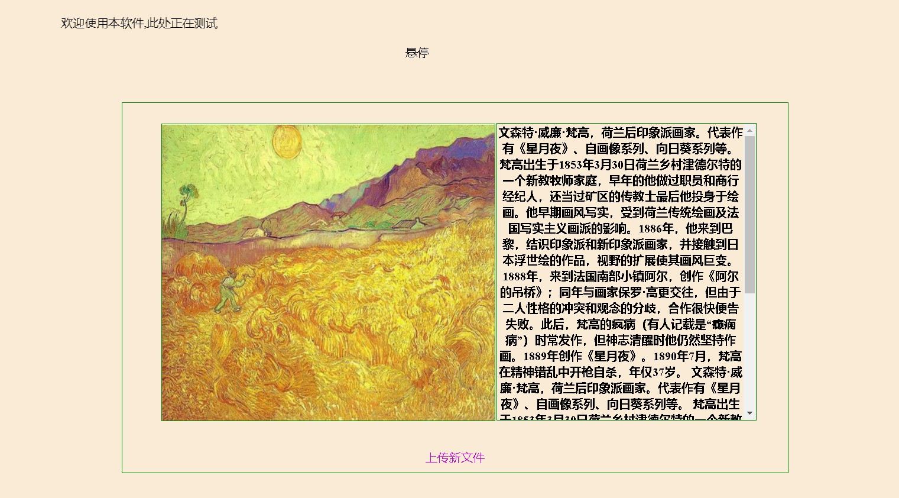

# Identify-the-author-by-looking-at-the-picture

## 看画识别作者
## 目的：创建网站上传图片返回作者信息

## 使用方式：
### 1.前端上传本地文件到服务器 2.服务器接收文件并进行识别 3.将识别结果发送到前端展示 

## 进度状况：

前端  | 后端  | 模型
 ---- | ----- | ------  
 基础框架已完成  | 正在编写 | 正在训练
 。。。  | 。。。 | 。。。
 
 ## 进度图片，持续更新ing
 
